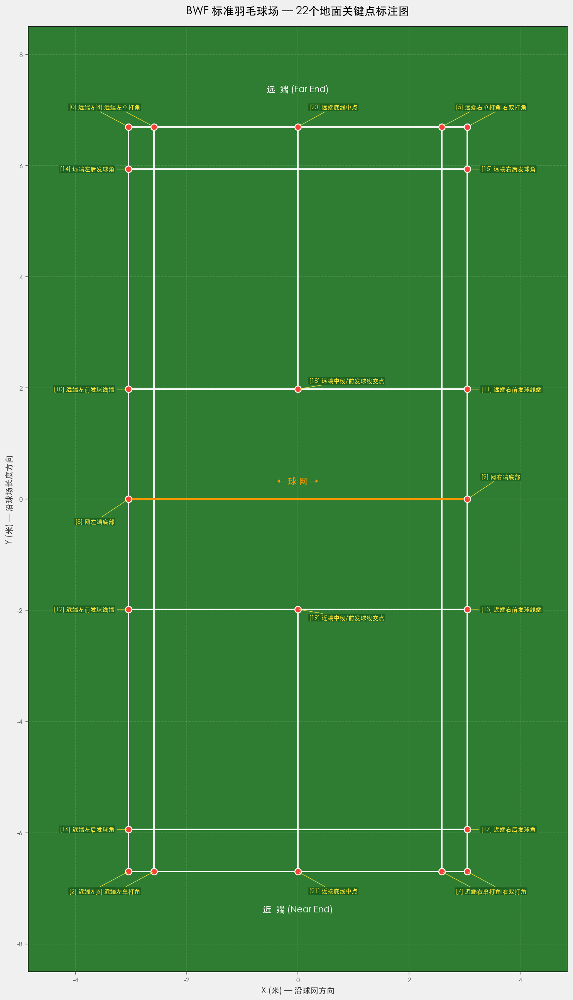
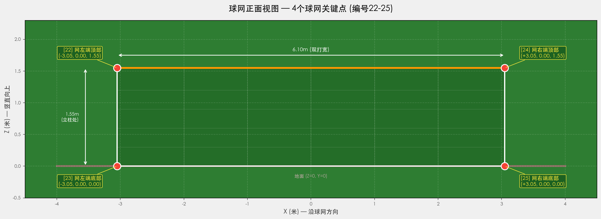
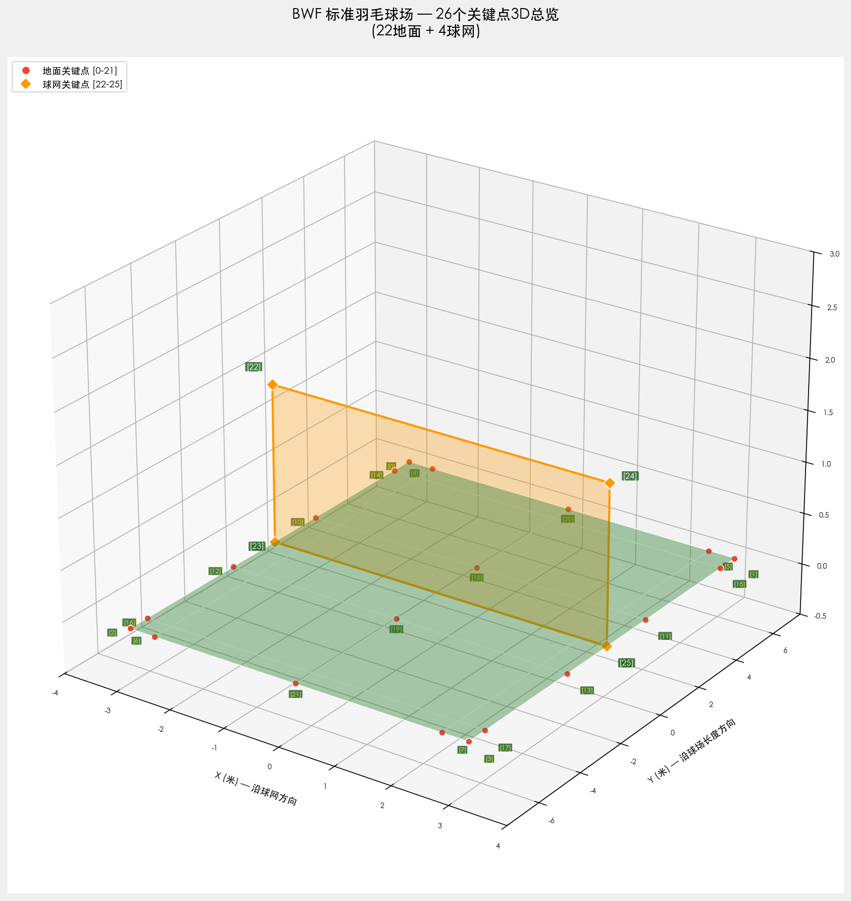

# 基础定义：坐标系、关键点与线段

本文档定义了整个项目的基础数据，所有模块共享。

---

## 1. 世界坐标系

- **原点**：球场中心（球网地面线中点）
- **X轴**：沿球网方向，面向球场时右侧为正
- **Y轴**：沿球场长度方向，远端（对面底线方向）为正
- **Z轴**：竖直向上
- **单位**：米

## 2. BWF 标准球场尺寸

| 参数 | 值 |
|------|-----|
| 全长 | 13.40m |
| 双打宽 | 6.10m（每侧3.05m） |
| 单打宽 | 5.18m（每侧2.59m） |
| 半场长 | 6.70m |
| 前发球线距网 | 1.98m |
| 双打后发球线距底线 | 0.76m（距网5.94m） |
| 球网高度（中心） | 1.524m |
| 球网高度（立柱处） | 1.55m |
| 球网深度 | 0.76m |

---

## 3. 地面关键点（22个，Z=0）

这22个点覆盖了标准羽毛球场上所有结构性线交点。选择依据：每个点都是两条及以上球场线的交叉点，具有明确的视觉特征，适合关键点检测。

```
编号   名称                           坐标 (X, Y) 米
────   ────                           ──────────────
 0     远端左双打角                    (-3.05, +6.70)
 1     远端右双打角                    (+3.05, +6.70)
 2     近端左双打角                    (-3.05, -6.70)
 3     近端右双打角                    (+3.05, -6.70)
 4     远端左单打角                    (-2.59, +6.70)
 5     远端右单打角                    (+2.59, +6.70)
 6     近端左单打角                    (-2.59, -6.70)
 7     近端右单打角                    (+2.59, -6.70)
 8     网左端底部                      (-3.05,  0.00)
 9     网右端底部                      (+3.05,  0.00)
10     远端左前发球线端                (-3.05, +1.98)
11     远端右前发球线端                (+3.05, +1.98)
12     近端左前发球线端                (-3.05, -1.98)
13     近端右前发球线端                (+3.05, -1.98)
14     远端左后发球角(双打)            (-3.05, +5.94)
15     远端右后发球角(双打)            (+3.05, +5.94)
16     近端左后发球角(双打)            (-3.05, -5.94)
17     近端右后发球角(双打)            (+3.05, -5.94)
18     远端中线/前发球线交点           ( 0.00, +1.98)
19     近端中线/前发球线交点           ( 0.00, -1.98)
20     远端底线中点                    ( 0.00, +6.70)
21     近端底线中点                    ( 0.00, -6.70)
```



## 4. 球网关键点（4个）

球网检测使用独立的 YOLO 模型，定义4个球网矩形角点作为关键点：

```
编号   名称              坐标 (X, Y, Z) 米
────   ────              ────────────────
22     网左端顶部        (-3.05, 0.00, 1.55)
23     网左端底部        (-3.05, 0.00, 0.00)
24     网右端顶部        (+3.05, 0.00, 1.55)
25     网右端底部        (+3.05, 0.00, 0.00)
```

> 关键点23与地面关键点8为同一物理点（网左端底部），关键点25与地面关键点9为同一物理点（网右端底部）。此冗余为故意设计，用于球网检测模型与球场检测模型之间的交叉验证。

球网模型内部使用编号0-3，与全局编号的映射关系：

| 球网模型编号 | 全局编号 | 名称 |
|-------------|---------|------|
| 0 | 22 | 网左端顶部 |
| 1 | 23 | 网左端底部 |
| 2 | 24 | 网右端顶部 |
| 3 | 25 | 网右端底部 |



### 4.1 全部26关键点3D总览

下图展示了22个地面关键点和4个球网关键点在三维空间中的位置关系：



## 5. 水平翻转对应 (flip_idx)

球场检测和球网检测使用独立的 YOLO 模型，各自有独立的 flip_idx。

### 球场模型 flip_idx（22点，编号0-21）

```
court_flip_idx = [1,0, 3,2, 5,4, 7,6, 9,8, 11,10, 13,12, 15,14, 17,16, 18,19, 20,21]
```

18、19（中线/前发球线交点）、20、21（底线中点）在翻转后保持不变。

### 球网模型 flip_idx（4点，模型内部编号0-3）

```
net_flip_idx = [2, 3, 0, 1]
```

0(左顶) ↔ 2(右顶)，1(左底) ↔ 3(右底)。

## 6. 球场线段定义

定义所有需要渲染的线段，每条线段用两个关键点索引表示：

```
COURT_LINE_SEGMENTS = [
    # 双打外边界矩形
    (0, 1),   # 远端底线
    (1, 3),   # 右侧双打边线
    (3, 2),   # 近端底线
    (2, 0),   # 左侧双打边线

    # 单打边线
    (4, 6),   # 左单打边线
    (5, 7),   # 右单打边线

    # 球网地面线
    (8, 9),

    # 前发球线（横跨双打全宽）
    (10, 11), # 远端前发球线
    (12, 13), # 近端前发球线

    # 双打后发球线
    (14, 15), # 远端
    (16, 17), # 近端

    # 中线（从前发球线到底线）
    (18, 20),  # 远端中线
    (19, 21),  # 近端中线
]
```
