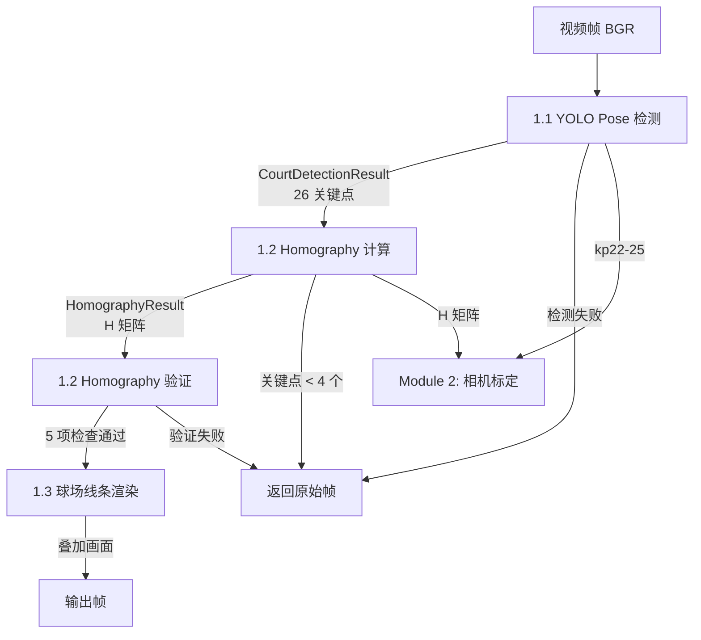
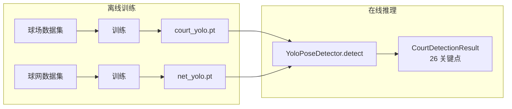

# Module 1: 球场检测与渲染

## 1. 概述

Module 1 从视频帧中检测球场关键点，计算 Homography 矩阵，渲染标准球场线条叠加到画面上。它是整个系统的入口模块，为 Module 2（相机标定）和后续分析提供基础几何信息。

## 2. 子模块

| 编号 | 子模块 | 代码文件 | 文档 |
|------|--------|----------|------|
| 1.1 | YOLO Pose 检测器 | `module1/yolo_detector.py` | [yolo_pose_detector.md](yolo_pose_detector.md) |
| 1.2 | Homography 计算与验证 | `module1/homography.py` | [homography.md](homography.md) |
| 1.3 | 球场线条渲染 + 球网投影 | `module1/court_renderer.py`, `module1/net_overlay.py` | [court_renderer.md](court_renderer.md) |
| - | YOLO 模型训练 | `training/` | [training_guide.md](training_guide.md) |

## 3. 数据流



## 4. YOLO Pose 模型

使用两个独立的 YOLO Pose 模型分别检测地面关键点和球网关键点：

| | 球场关键点模型 | 球网关键点模型 |
|------|---------------|---------------|
| 检测目标 | 22 个地面关键点 | 4 个球网角点 |
| 数据集 | `yolo/datasets/court/` (1,194 张) | `yolo/datasets/net/` (495 张) |
| kpt_shape | [22, 3] | [4, 3] |
| 推理权重 | `yolo/weights/court_yolo.pt` | `yolo/weights/net_yolo.pt` |



训练命令：
```bash
python -m training.train --dataset-dir yolo/datasets/court              # 球场模型
python -m training.train --dataset-dir yolo/datasets/net --model-type net  # 球网模型
```

## 5. 核心数据结构

```python
@dataclass
class KeypointDetection:
    index: int              # 0-25 全局索引
    pixel_xy: np.ndarray    # shape (2,)
    confidence: float
    visible: bool

@dataclass
class CourtDetectionResult:
    keypoints: list[KeypointDetection]   # 长度 26
    bbox: np.ndarray                      # shape (4,)
    bbox_confidence: float
    num_visible: int

@dataclass
class HomographyResult:
    H: np.ndarray              # (3,3) 球场→像素
    H_inv: np.ndarray          # (3,3) 像素→球场
    inlier_mask: np.ndarray    # (N,) bool
    num_inliers: int
    num_correspondences: int
    reprojection_error: float  # 内点平均误差 (px)
    used_indices: np.ndarray
    used_court_pts: np.ndarray
    used_pixel_pts: np.ndarray
```

## 6. 实现步骤

| 步骤 | 文件 | 验证方式 |
|------|------|----------|
| 1 | `config/court_config.py` | `from config.court_config import COURT_KEYPOINTS_2D; assert shape==(22,2)` |
| 2 | `utils/geometry.py` | `from utils.geometry import line_intersection` |
| 3 | `module1/yolo_detector.py` | 加载两个模型，对测试图推理返回 CourtDetectionResult |
| 4 | `module1/homography.py` | 合成测试：已知 H 投影 22 点加噪声，恢复 H，重投影 < 3px |
| 5 | `module1/court_renderer.py` | 批量投影函数正确工作 |
| 6 | `module1/net_overlay.py` | 球网立柱底部投影正确 |
| 7 | `scripts/run_module1.py` | 对数据集中图片运行端到端测试 |

## 7. Homography 验证门控

H 矩阵通过 5 项验证才能进入 Module 2：

| 检查项 | 阈值 | 说明 |
|--------|------|------|
| 重投影误差 | < 5.0 px | 内点平均误差 |
| 内点比例 | > 70% | RANSAC 内点占比 |
| 行列式绝对值 | > 1e-10 | 非退化（det<0 正常，因 Y 轴翻转） |
| 条件数 | < 1e6 | 数值稳定性 |
| 奇异值比 max/min | < 1e5 | 真实透视变换可达 1e4 量级 |

## 8. 关键设计决策

1. **索引映射复用** — 从 `training.keypoint_mapping` 导入映射，不重复定义
2. **部分失败容忍** — 球网模型失败时仍返回球场关键点（球网点置信度=0）
3. **cv2.perspectiveTransform** — 替代手写齐次坐标乘法，数值稳定且支持批量
4. **验证与计算分离** — `compute_homography` 和 `validate_homography` 独立调用
5. **project_points_batch 定义在 court_renderer.py** — 作为通用投影工具，Module 2 也导入使用

## 9. 输出

| 输出 | 消费者 |
|------|--------|
| `CourtDetectionResult` (26 关键点) | Module 1.2, Module 2.2, Module 2.5 |
| `HomographyResult` (H 矩阵) | Module 1.3, Module 2.5, Module 2.6 |
| 叠加画面 | 视频输出 |
