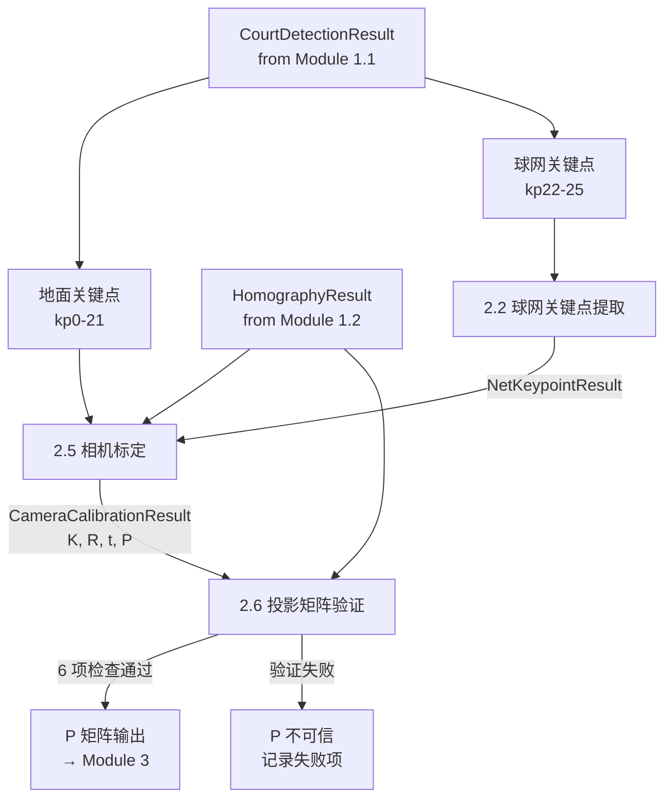
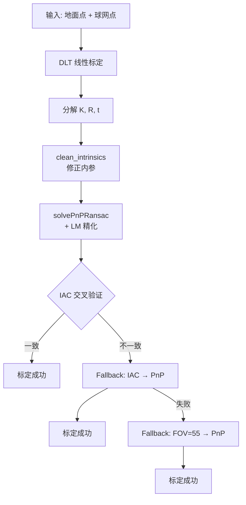

# Module 2: 球网检测与相机标定

## 1. 概述

Module 2 从球网关键点定位中推断相机完整 3D 投影参数。利用 Module 1 检测的地面关键点和球网关键点，通过 DLT + PnP 标定方法求解投影矩阵 P = K[R|t]，为 Module 3 的 3D 轨迹重建提供相机模型。

## 2. 子模块

| 编号 | 子模块 | 代码文件 | 文档 |
|------|--------|----------|------|
| 2.2 | 球网关键点提取 | `module2/net_top_detector_yolo.py` | [net_detector_yolo.md](net_detector_yolo.md) |
| 2.5 | 相机标定 | `module2/camera_calibration.py` | [camera_calibration.md](camera_calibration.md) |
| 2.6 | 投影矩阵验证 | `module2/projection_validation.py` | [projection_validation.md](projection_validation.md) |

## 3. 数据流



## 4. 标定策略



- **固定机位**：多帧平均 → DLT → PnP 精化 + IAC 交叉验证
- **移动机位**：calibrateCamera → PnP

## 5. 核心数据结构

```python
@dataclass
class NetKeypointResult:
    left_top_pixel: np.ndarray      # (2,) kp22
    right_top_pixel: np.ndarray     # (2,) kp24
    left_base_pixel: np.ndarray     # (2,) kp23
    right_base_pixel: np.ndarray    # (2,) kp25
    left_top_3d: np.ndarray         # (3,) 世界坐标
    right_top_3d: np.ndarray        # (3,)
    left_base_3d: np.ndarray        # (3,)
    right_base_3d: np.ndarray       # (3,)

@dataclass
class CameraCalibrationResult:
    K: np.ndarray           # (3,3) 内参矩阵
    R: np.ndarray           # (3,3) 旋转矩阵
    tvec: np.ndarray        # (3,1) 平移向量
    P: np.ndarray           # (3,4) 投影矩阵 P = K[R|t]
    reprojection_error: float
```

## 6. 投影矩阵验证

6 项检查确保 P 矩阵质量：

| 检查项 | 说明 |
|--------|------|
| 重投影误差 | 3D→2D 重投影与检测的偏差 |
| 相机位置 | 相机在球场上方合理位置 |
| R 正交性 | det(R) ≈ 1, R^T R ≈ I |
| 内参合理性 | fx/fy 比例、主点位置 |
| 球场中心投影 | 球场中心 (0,0,0) 投影到画面内 |
| H-P 一致性 | P 的地面投影与 Module 1 的 H 矩阵一致 |

## 7. 实现步骤

| 步骤 | 文件 | 说明 |
|------|------|------|
| 0 | `config/court_config.py` | 新增 `COURT_KEYPOINTS_3D` (22,3) |
| 1 | `module2/net_top_detector_yolo.py` | 提取 kp22-25，输出 NetKeypointResult |
| 2 | `module2/camera_calibration.py` | DLT → PnP 标定流程 |
| 3 | `module2/projection_validation.py` | 6 项验证检查 |
| 4 | `scripts/run_module2.py` | 独立运行入口 |

## 8. 关键设计决策

1. **直接使用 YOLO 原始值** — 球网模型精度高，`extract_net_keypoints` 不依赖 H 矩阵，降低模块间耦合
2. **聚焦单帧标定** — 核心单帧 DLT → PnP 流程，多帧平滑由时间域滤波器处理
3. **复用已有代码** — `project_points_batch`、`line_intersection`、`HomographyResult` 等来自 Module 1

## 9. 输出

| 输出 | 消费者 |
|------|--------|
| `CameraCalibrationResult` (K, R, t, P) | Module 2.6 验证, Module 3 MHE |
| `P` (3x4 投影矩阵) | Module 3 的 `RallySegment.P` |
