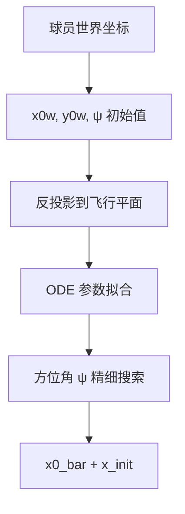

# Module 3: 初始化策略

初始化质量直接影响 SQP 收敛性。采用多阶段策略。

## 初始化流程



## 四步初始化策略

```
步骤 1: 球员位置先验
    ├── x0w, y0w ← 击球方世界坐标
    └── ψ ← arctan2(y_R − y_H, x_R − x_H)     (击球方 → 接球方方向)

步骤 2: 反投影到飞行平面
    ├── 给定 ψ，将每个 2D 检测反投影到飞行平面
    └── 利用 P 矩阵和飞行平面几何约束，求解 (s_k, z_k)

步骤 3: 阻力曲线拟合
    ├── scipy.optimize.least_squares
    └── 拟合参数: [z₀, v_s0, v_z0, c_d] 使 ODE 积分匹配 (s_k, z_k) 序列

步骤 4: 方位角精细搜索（可选）
    ├── 在 ψ ± 15° 范围采样多个候选角度
    └── 逐个执行步骤 2-3，取最小拟合残差的 ψ 值
```

## 反投影方法

给定方位角 ψ 和像素坐标 (u, v)，利用 P 矩阵和飞行平面约束求解 s 和 z：

```
世界坐标: [x0w + s·cos(ψ), y0w + s·sin(ψ), z, 1]
像素约束: P · [X_w, Y_w, Z_w, 1]ᵀ = λ · [u, v, 1]ᵀ

消去 λ 后得到 2 个方程 2 个未知数 (s, z) 的线性系统，
可直接求解。
```

飞行平面的几何定义及 ODE 模型详见 [physics_model.md](physics_model.md)。
