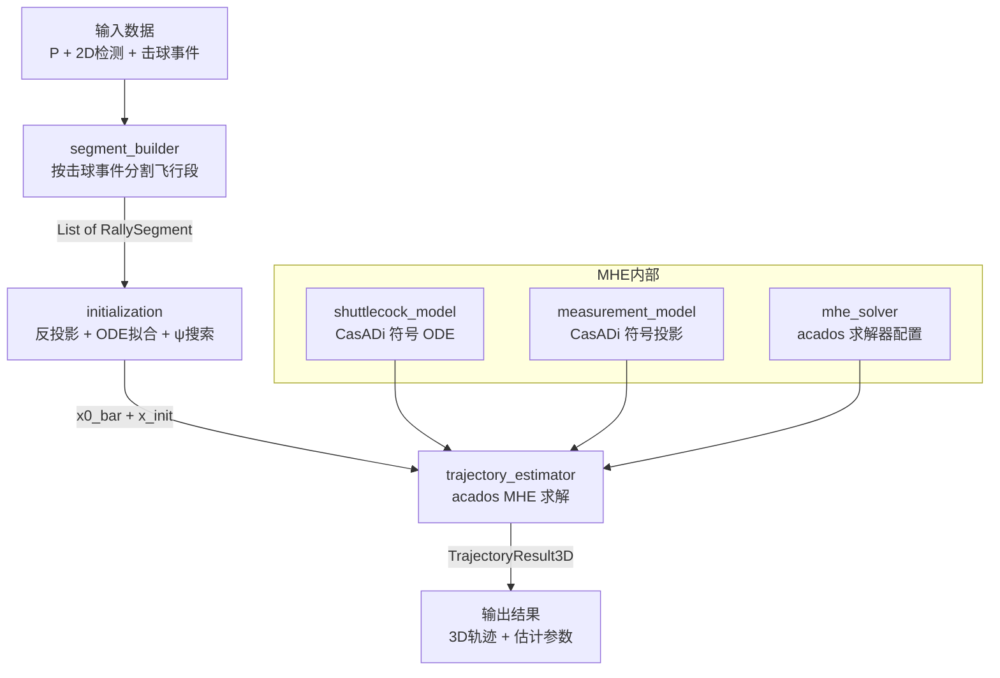
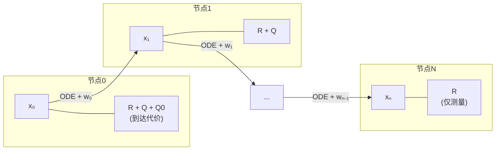

# Module 3: 单目视频羽毛球 3D 轨迹重建

## 1. 概述

### 1.1 目标

给定外部模块提供的 2D 羽毛球检测序列、击球事件、球员世界坐标，以及 Module 2 输出的相机投影矩阵 P (3x4)，利用羽毛球空气动力学 ODE 约束，通过移动时域估计 (Moving Horizon Estimation, MHE) 优化方法，将 2D 像素轨迹还原为 3D 世界坐标轨迹。

所有输入（2D 检测、击球事件、球员位置）均由外部模块提供，Module 3 仅负责 3D 轨迹估计。

### 1.2 方法概述

核心思想源自 MonoTrack [2] 的物理约束非线性优化方法，并在求解框架上进行扩展：

| 特性 | MonoTrack [2] | 本方案 (Module 3) |
|------|---------------|-------------------|
| 动力学模型 | 3D 纯阻力 ODE (Cohen 2015) | 2D 飞行平面 ODE + 方位角参数化 |
| 优化方法 | Shooting (scipy) | MHE (acados) |
| 决策变量 | 初始条件 + C_d | 全节点状态 + 参数 + 过程噪声 |
| 模型柔性 | 刚性（无过程噪声） | 柔性（过程噪声吸收标定误差） |
| 求解器 | 通用 NLP | 结构化 QP (HPIPM) |

**MHE 与 Shooting 的关系**: 当过程噪声权重 Q → ∞ 时，MHE 退化为 MonoTrack 的 shooting 方法。设置 Q >> R 使 MHE 近似 shooting 行为，同时通过有限的过程噪声提供数值鲁棒性。

### 1.3 输入/输出

**输入**:
- `P` (3x4): Module 2 提供的相机投影矩阵
- `K` (3x3): Module 2 提供的内参矩阵
- `List[ShuttlecockDetection]`: 每帧 2D 像素位置 + 可见性 + 置信度
- `List[HitEvent]`: 击球帧索引 + 击球方球员世界坐标

**输出**:
- `List[TrajectoryResult3D]`: 每个飞行段的 3D 轨迹 + 估计参数 + 质量指标

## 2. 子文档索引

| 主题 | 文档 | 内容 |
|------|------|------|
| 物理模型 | [physics_model.md](physics_model.md) | 空气动力学 ODE、飞行平面简化、物理常数 |
| MHE 建模 | [mhe_formulation.md](mhe_formulation.md) | 增广状态、测量模型、代价函数、权重、约束 |
| acados 实现 | [acados_implementation.md](acados_implementation.md) | CasADi 模型、求解器配置、离散化、时间对齐 |
| 初始化策略 | [initialization.md](initialization.md) | 反投影、ODE 拟合、方位角搜索 |
| 数据结构 | [data_structures.md](data_structures.md) | 输入/输出数据类定义 |
| 依赖与安装 | [installation.md](installation.md) | acados 编译、环境配置、故障排除 |

## 3. 系统架构



### 3.1 核心子模块

| 子模块 | 代码文件 | 职责 |
|--------|----------|------|
| 物理模型 | `shuttlecock_model.py` | CasADi 符号动力学（增广状态 + 过程噪声） |
| 测量模型 | `measurement_model.py` | CasADi 符号投影（飞行平面 → 世界 → 像素） |
| MHE 配置 | `mhe_solver.py` | acados OCP/MHE 求解器构建与配置 |
| 轨迹估计器 | `trajectory_estimator.py` | 主求解器封装（设置参数 → 求解 → 提取结果） |
| 初始化 | `initialization.py` | 初始猜测策略（反投影 + 曲线拟合 + 方位角搜索） |
| 段构建器 | `segment_builder.py` | 检测序列按击球事件分割为飞行段 |
| 数据结构 | `result_types.py` | 输入/输出数据类定义 |
| 物理配置 | `config/physics_config.py` | 物理常数 + 求解器超参数 |

### 3.2 MHE 节点结构



- **R**: 测量残差权重（像素空间）
- **Q**: 过程噪声惩罚（Q >> R，噪声仅作"安全阀"）
- **Q0**: 到达代价（初始状态偏离先验的惩罚）

详见 [mhe_formulation.md](mhe_formulation.md)。

## 4. 项目结构

```
airforce/
├── config/
│   └── physics_config.py               # PhysicsConfig + MHEConfig
├── module3/
│   ├── __init__.py
│   ├── shuttlecock_model.py            # CasADi 符号动力学模型
│   ├── measurement_model.py            # CasADi 符号投影函数
│   ├── mhe_solver.py                   # acados MHE 求解器配置
│   ├── trajectory_estimator.py         # 主求解器类
│   ├── initialization.py              # 初始猜测生成
│   ├── segment_builder.py             # 检测序列分割
│   └── result_types.py                # 数据结构定义
├── scripts/
│   └── run_module3.py                  # 独立运行入口
└── tests/
    └── test_module3/                   # 测试套件
        ├── run_tests.py               # 完整测试 + 可视化
        ├── synthetic_data.py          # 合成测试数据生成
        ├── plot_court_3d.py           # 3D 球场可视化
        └── validate_ode_integration.py # ODE 积分精度验证
```

### 4.1 配置参数

```python
@dataclass
class PhysicsConfig:
    M: float = 5.0e-3           # 质量 (kg)
    rho: float = 1.2            # 空气密度 (kg/m³)
    S: float = 28.0e-4          # 截面积 (m²)
    C_D: float = 0.65           # 阻力系数 (Cohen 2015)
    g: float = 9.81             # 重力加速度 (m/s²)
    # 派生属性: aero_length (~4.6m), cd_nominal (~0.218), terminal_velocity (~6.7 m/s)

@dataclass
class MHEConfig:
    sigma_pixel: float = 5.0    # 像素检测标准差 (px)
    q_pos: float = 100.0        # 位置噪声权重
    q_vel: float = 10.0         # 速度噪声权重
    # 到达代价权重: q0_s=0.1, q0_z=1.0, q0_vs=0.01, q0_vz=0.01,
    #              q0_psi=10.0, q0_cd=100.0, q0_x0w=10.0, q0_y0w=10.0
    # 积分器: ERK + RK4 + 4 substeps
```

完整定义见 `config/physics_config.py`。

## 5. 实施计划

| 阶段 | 步骤 | 内容 |
|------|------|------|
| Phase 1: 基础设施 | 1-3 | PhysicsConfig + MHEConfig, result_types, 合成轨迹生成器 |
| Phase 2: CasADi 模型 | 4-6 | shuttlecock_model, measurement_model, 单元测试 |
| Phase 3: acados MHE | 7-9 | mhe_solver, 零噪声/有噪声测试 |
| Phase 4: 初始化与集成 | 10-14 | initialization, segment_builder, trajectory_estimator, 端到端测试 |
| Phase 5: 验证与鲁棒性 | 15-17 | 边界情况、参数灵敏度、性能基准 |

## 6. 验证方案

| 测试项 | 方法 | 通过标准 |
|--------|------|----------|
| ODE 积分（无阻力） | 与解析抛物线对比 | 误差 < 1e-6 |
| ODE 积分（有阻力） | 终端速度收敛 | 误差 < 1% U_inf |
| 测量模型 | 与 cv2.projectPoints 对比 | 误差 < 1e-4 px |
| MHE 求解（零噪声） | 恢复参数 vs 真值 | 参数误差 < 1% |
| MHE 求解（2 px 噪声） | 重投影误差 | 平均 < 5 px |
| MHE 求解（5 px 噪声 + 30% 缺失） | 求解成功率 | 成功，平均 < 10 px |
| 初始化质量 | 初始猜测 vs 真值 | psi 误差 < 15 deg，速度误差 < 30% |

**参考基准** (MonoTrack [2]):
- 合成数据 3D 重建误差：8.0 cm（含先验），14.9 cm（仅重投影损失）
- 真实数据重投影误差：8~10 px（ground truth 输入），23~37 px（端到端）

## 7. 风险与缓解

| 风险 | 影响 | 缓解策略 |
|------|------|----------|
| SQP 收敛到局部最优 | 估计错误轨迹 | 多初始化 + psi 搜索 + 球员位置先验 |
| 透视除法 ill-conditioning | 求解器不收敛 | 球在合理距离 (3~30m)，w_h 恒正 |
| 极短飞行段 (<10 帧) | 欠定问题 | 加强到达代价 Q0 约束 |
| acados 编译开销 (~5s) | 首次求解慢 | 求解器缓存 + 预编译常见 N 值 |
| 单目深度模糊 | 深度估计不准 | 阻力模型提供物理约束区分深度 |
| Q 权重调优困难 | Q 过小 → 过拟合；Q 过大 → 难收敛 | 默认 Q/R ~ 100-1000；合成数据标定 |
| 网前球模型不准 | 旋转/翻转效应显著 | Cohen [1, §3.1]: 仅占 ~18% 击球 |

## 参考文献

1. Cohen C, Darbois Texier B, Quere D, Clanet C. "The physics of badminton." *New Journal of Physics*, 17(6):063001, 2015.
2. Liu P, Wang J-H. "MonoTrack: Shuttle trajectory reconstruction from monocular badminton video." *arXiv:2204.01899v2*, 2022.
3. acados -- `examples/acados_python/pendulum_on_cart/mhe/` (MHE 参考实现)
