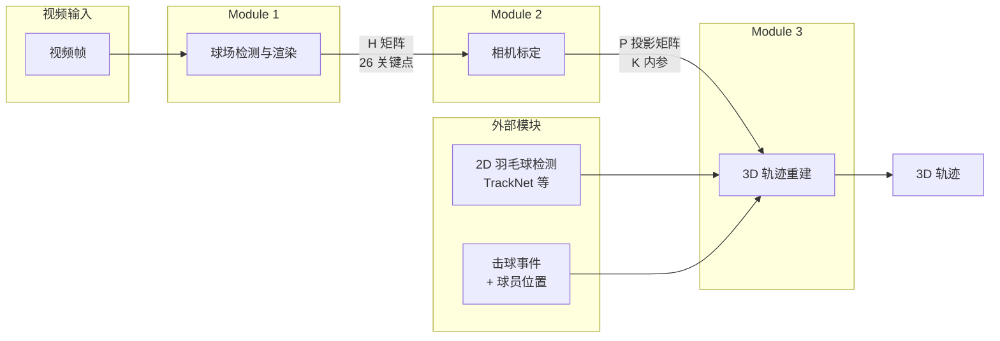
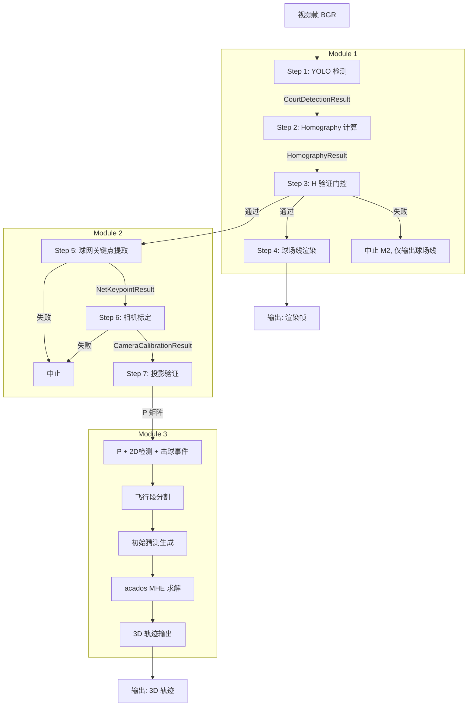

# 羽毛球场地视频分析系统 — 项目总览

## 1. 项目概述

本系统针对手机/摄像头拍摄的羽毛球比赛视频，实现从 2D 视频到 3D 轨迹重建的完整流水线：

- **Module 1** — 球场检测与渲染：YOLO 关键点检测 → Homography 计算 → 球场线条叠加
- **Module 2** — 相机标定：球网关键点提取 → DLT/PnP 求解 → 投影矩阵 P
- **Module 3** — 3D 轨迹重建：羽毛球 2D 检测 + 物理 ODE 约束 → MHE 优化 → 3D 世界坐标轨迹

## 2. 三模块依赖关系



## 3. 模块文档索引

| 模块 | 功能 | 文档入口 |
|------|------|----------|
| Module 1 | 球场检测与渲染 | [module1/plan.md](module1/plan.md) |
| Module 2 | 相机标定 | [module2/plan.md](module2/plan.md) |
| Module 3 | 3D 轨迹重建 (MHE) | [module3/plan.md](module3/plan.md) |

## 4. 共享文档

| 文档 | 内容 |
|------|------|
| [base_definitions.md](base_definitions.md) | 坐标系、26 关键点定义、球场尺寸、线段定义 |
| [error_management.md](error_management.md) | 跨模块误差预算与缓解策略 |
| [implementation_guide.md](implementation_guide.md) | 实施路线图、设计决策、OpenCV 接口速查 |
| [temporal_filter.md](temporal_filter.md) | 时间域 EMA 平滑 + 标定锁定策略 |

## 5. 全流程 Pipeline



每一步失败会立即中止后续步骤，`FrameResult.failed_step` 记录中止位置。

## 6. 项目结构

```
airforce/
├── config/
│   ├── court_config.py              # 标准球场尺寸、26 关键点坐标、线段定义
│   └── physics_config.py            # 羽毛球物理常数 + MHE 超参数
├── module1/                         # 球场检测与渲染
│   ├── yolo_detector.py             # YOLO pose 推理封装
│   ├── homography.py                # Homography 计算与验证
│   ├── court_renderer.py            # 球场线条叠加渲染
│   └── net_overlay.py               # 球网地面线投影
├── module2/                         # 球网检测与相机标定
│   ├── net_top_detector_yolo.py     # 球网关键点提取
│   ├── camera_calibration.py        # 相机标定 (DLT + PnP)
│   └── projection_validation.py     # 投影矩阵验证
├── module3/                         # 3D 轨迹重建
│   ├── shuttlecock_model.py         # CasADi 符号动力学模型
│   ├── measurement_model.py         # CasADi 符号投影函数
│   ├── mhe_solver.py                # acados MHE 求解器配置
│   ├── trajectory_estimator.py      # 主求解器封装
│   ├── initialization.py            # 初始猜测生成
│   ├── segment_builder.py           # 检测序列分割
│   └── result_types.py              # 数据结构定义
├── training/                        # YOLO 模型训练 (离线)
├── utils/                           # 共用工具
├── scripts/                         # 运行入口脚本
├── tests/                           # 测试
├── external/                        # acados 等外部依赖
└── docs/                            # 文档
    ├── structure.md                 # 本文档 (项目总览)
    ├── module1/                     # Module 1 文档
    ├── module2/                     # Module 2 文档
    └── module3/                     # Module 3 文档
```

## 7. 核心数据结构

模块间传递的关键数据结构：

| 数据结构 | 产生者 | 消费者 | 核心字段 |
|----------|--------|--------|----------|
| `CourtDetectionResult` | M1.1 YOLO | M1.2, M2.2 | `keypoints[26]`, `bbox`, `num_visible` |
| `HomographyResult` | M1.2 Homography | M1.3, M2.5, M2.6 | `H`(3x3), `H_inv`, `reprojection_error` |
| `NetKeypointResult` | M2.2 球网提取 | M2.5 | 4 个角点像素/3D 坐标 |
| `CameraCalibrationResult` | M2.5 标定 | M2.6, M3 | `K`, `R`, `tvec`, `P`(3x4) |
| `RallySegment` | M3 段构建 | M3 MHE | `detections`, `P`, `hit_start/end` |
| `TrajectoryResult3D` | M3 MHE | 下游分析 | `world_positions`, `psi`, `cd`, `v0` |

## 8. 技术选型

| 类别 | 选型 | 模块 |
|------|------|------|
| 关键点检测 | YOLOv8/YOLO11 Pose | M1 |
| 平面映射 | `cv2.findHomography` (RANSAC) | M1 |
| 相机标定 | DLT + `cv2.solvePnPRansac` | M2 |
| 时间域平滑 | EMA (alpha=0.4) + 标定锁定 | M1, M2 |
| 3D 轨迹优化 | acados MHE (NONLINEAR_LS) | M3 |
| 动力学建模 | CasADi 符号微分 | M3 |
| QP 求解器 | HPIPM (PARTIAL_CONDENSING) | M3 |

## 9. 实施阶段

| 阶段 | 目标 | 涉及模块 | 状态 |
|------|------|----------|------|
| 阶段 1 | 基础设施：项目骨架、配置文件、工具函数 | config, utils | 完成 |
| 阶段 2 | Module 1：关键点检测 + Homography + 渲染 | M1.1, M1.2, M1.3 | 完成 |
| 阶段 3 | Module 2：球网检测 + 标定 | M2.2, M2.5, M2.6 | 完成 |
| 阶段 4 | Module 3：3D 轨迹重建 | M3 全部 | 完成 |
| 阶段 5 | 集成验证：全流程串联 + 端到端测试 | pipeline | 进行中 |

## 10. 运行命令

```bash
# Module 1: 球场检测与渲染
python -m scripts.run_module1 --input video.mp4 --output output.mp4

# Module 2: 相机标定
python -m scripts.run_module2 --input video.mp4 --output output.mp4

# Module 3: 3D 轨迹重建测试
python -m tests.test_module3.run_tests

# 全流程
python -m scripts.run_pipeline --input video.mp4 --output output.mp4
```
