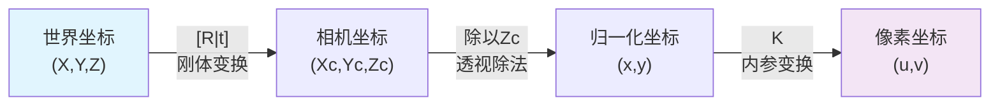
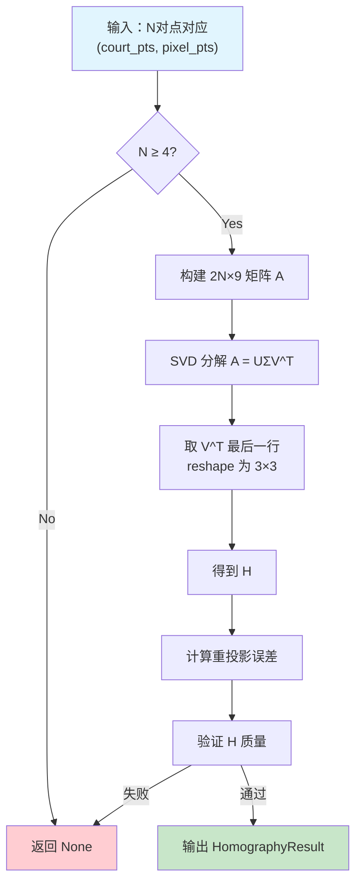
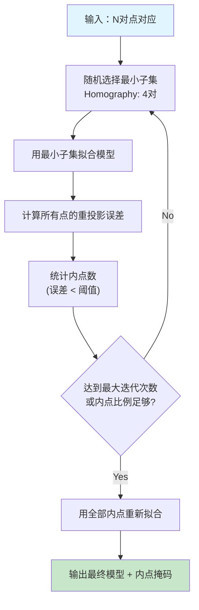
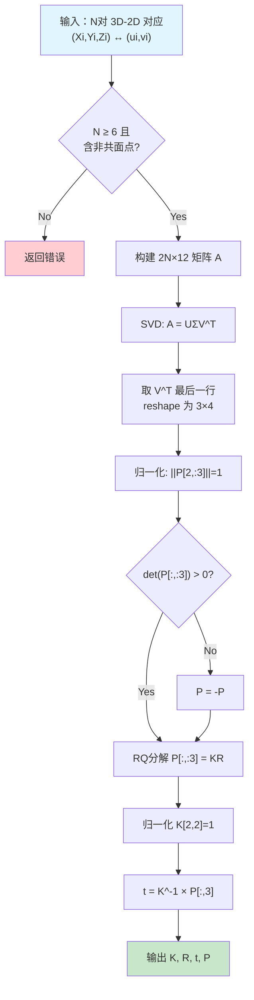
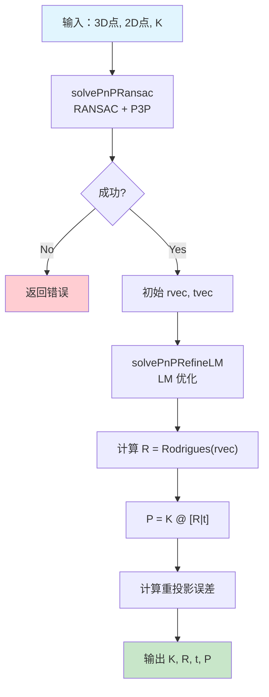
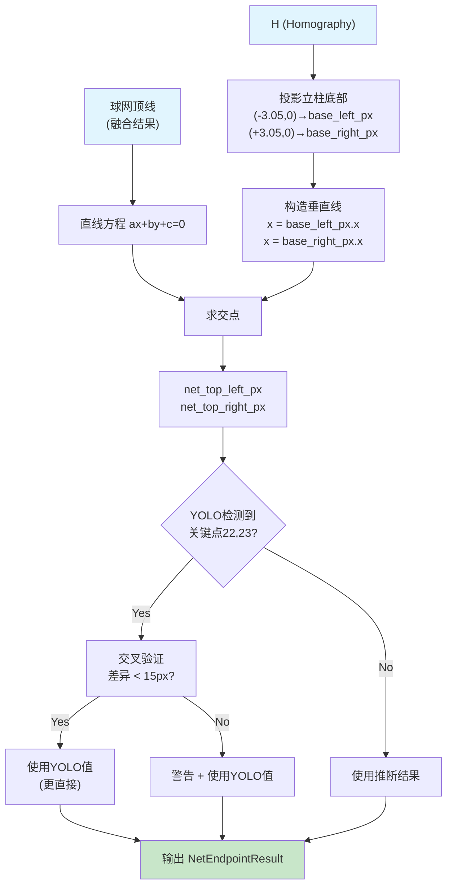
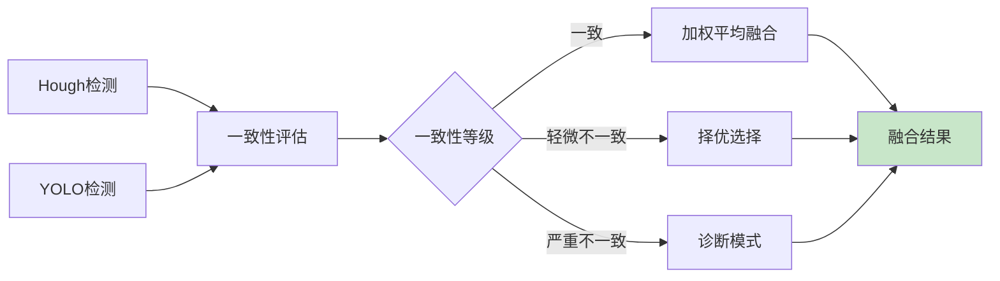
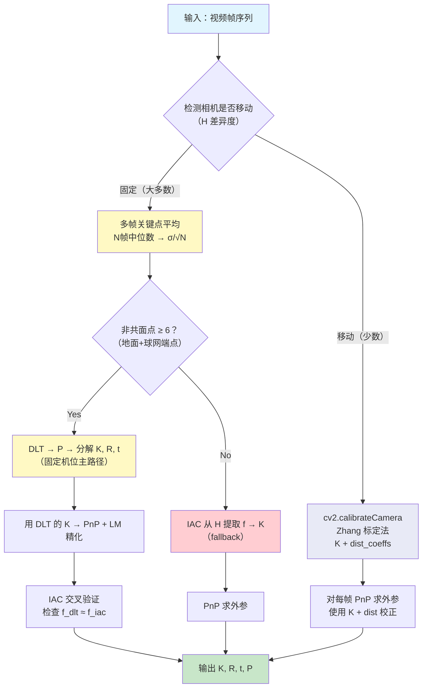
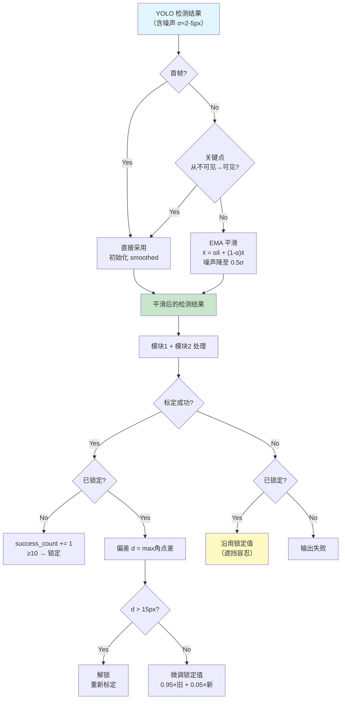

# 羽毛球场地视频分析系统 — 算法原理讲解

本文档对实施方案（`plan.md`）中涉及的核心算法原理进行深入讲解，侧重数学推导、几何直觉和设计选择的理由。

---

## 目录

1. [针孔相机模型与投影矩阵](#1-针孔相机模型与投影矩阵)
2. [单应性矩阵（Homography）](#2-单应性矩阵homography)
3. [Homography 与投影矩阵的关系](#3-homography-与投影矩阵的关系)
4. [RANSAC 鲁棒估计](#4-ransac-鲁棒估计)
5. [DLT 方法求解投影矩阵](#5-dlt-方法求解投影矩阵)
6. [PnP 问题与求解](#6-pnp-问题与求解)
7. [球网端点推断的几何原理](#7-球网端点推断的几何原理)
8. [双路检测融合原理](#8-双路检测融合原理)
9. [误差分析与传播](#9-误差分析与传播)
10. [从 Homography 分解相机参数](#10-从-homography-分解相机参数)
11. [时间域平滑原理](#11-时间域平滑原理)

---

## 1. 针孔相机模型与投影矩阵

### 1.1 针孔模型

针孔相机模型（Pinhole Camera Model）是计算机视觉中最基本的相机模型。它将3D世界中的点通过一个无限小的孔（光心）投影到成像平面上。

**几何示意**：
```
                    世界点 P(X,Y,Z)
                         *
                        /
                       /
                      /
      ─────────────O────────────── 光轴
                  / (光心)
                 /
                /
            ──*──────────── 成像平面
             p(u,v)
```

### 1.2 坐标系定义

整个投影过程涉及4个坐标系的转换：

```
世界坐标系 (Xw, Yw, Zw)
    ↓  [R|t] 外参
相机坐标系 (Xc, Yc, Zc)
    ↓  透视投影
归一化图像坐标 (x, y)
    ↓  K 内参
像素坐标 (u, v)
```

### 1.3 内参矩阵 K

内参矩阵描述了相机的内部光学和几何属性：

$$K = \begin{bmatrix} f_x & s & c_x \\ 0 & f_y & c_y \\ 0 & 0 & 1 \end{bmatrix}$$

各参数含义：

| 参数 | 含义 | 典型值 |
|------|------|--------|
| $f_x$ | x方向焦距（像素单位） | 800-2000px（手机） |
| $f_y$ | y方向焦距（像素单位） | 通常 $f_x \approx f_y$ |
| $c_x$ | 主点x坐标（图像中心偏移） | ≈ image_width / 2 |
| $c_y$ | 主点y坐标 | ≈ image_height / 2 |
| $s$ | 倾斜因子（skew） | 通常为0 |

**焦距与视场角的关系**：

$$f_x = \frac{W}{2 \tan(\text{FOV}_h / 2)}$$

其中 W 是图像宽度（像素），$\text{FOV}_h$ 是水平视场角。手机摄像头典型 FOV≈55°-70°。

**物理焦距 vs 像素焦距**：如果传感器像素尺寸为 $\delta$（mm/pixel），物理焦距为 $f$（mm），则 $f_x = f / \delta_x$，$f_y = f / \delta_y$。对于方形像素 $f_x = f_y$。

### 1.4 外参矩阵 [R|t]

外参描述世界坐标系到相机坐标系的刚体变换（旋转+平移）：

$$\begin{bmatrix} X_c \\ Y_c \\ Z_c \end{bmatrix} = R \begin{bmatrix} X_w \\ Y_w \\ Z_w \end{bmatrix} + t$$

- $R$：3×3 旋转矩阵，满足 $R^TR = I$，$\det(R) = 1$（正交矩阵，行列式为1）
- $t$：3×1 平移向量
- 旋转矩阵有3个自由度（如欧拉角或 Rodrigues 向量表示），平移有3个自由度，共6个自由度

**Rodrigues 表示**：OpenCV 中常用 Rodrigues 向量 $\vec{r} = \theta \hat{n}$ 来紧凑表示旋转，其中 $\hat{n}$ 是旋转轴的单位向量，$\theta = ||\vec{r}||$ 是旋转角度。转换关系：

$$R = \cos\theta \cdot I + (1-\cos\theta) \hat{n}\hat{n}^T + \sin\theta [\hat{n}]_\times$$

### 1.5 完整投影公式

将3D世界点 $(X_w, Y_w, Z_w)$ 投影到像素 $(u, v)$：

$$s \begin{bmatrix} u \\ v \\ 1 \end{bmatrix} = K [R | t] \begin{bmatrix} X_w \\ Y_w \\ Z_w \\ 1 \end{bmatrix} = P \begin{bmatrix} X_w \\ Y_w \\ Z_w \\ 1 \end{bmatrix}$$

其中：
- $s$ 是齐次缩放因子（深度）
- $P = K[R|t]$ 是 3×4 投影矩阵
- 投影矩阵 P 有 11 个自由度（3×4=12个元素，减去1个尺度自由度）

展开来看：
$$\begin{bmatrix} su \\ sv \\ s \end{bmatrix} = \begin{bmatrix} p_{11} & p_{12} & p_{13} & p_{14} \\ p_{21} & p_{22} & p_{23} & p_{24} \\ p_{31} & p_{32} & p_{33} & p_{34} \end{bmatrix} \begin{bmatrix} X_w \\ Y_w \\ Z_w \\ 1 \end{bmatrix}$$

像素坐标为：
$$u = \frac{p_{11}X + p_{12}Y + p_{13}Z + p_{14}}{p_{31}X + p_{32}Y + p_{33}Z + p_{34}}, \quad v = \frac{p_{21}X + p_{22}Y + p_{23}Z + p_{24}}{p_{31}X + p_{32}Y + p_{33}Z + p_{34}}$$

### 1.6 相机位置的反算

相机在世界坐标系中的位置 $C$：

$$C = -R^T t$$

这是因为 $R \cdot C + t = 0$（相机光心在相机坐标系中位于原点）。

### 1.7 投影过程流程图



---

## 2. 单应性矩阵（Homography）

### 2.1 定义

Homography（单应性矩阵）是一个 3×3 可逆矩阵 $H$，描述两个平面之间的射影变换（Projective Transformation）。

在本项目中，H 描述 **球场地面平面**（2D球场坐标，单位米）到 **图像像素平面** 的映射：

$$s \begin{bmatrix} u \\ v \\ 1 \end{bmatrix} = H \begin{bmatrix} X \\ Y \\ 1 \end{bmatrix}$$

$$H = \begin{bmatrix} h_{11} & h_{12} & h_{13} \\ h_{21} & h_{22} & h_{23} \\ h_{31} & h_{32} & h_{33} \end{bmatrix}$$

### 2.2 自由度分析

H 是 3×3 矩阵，有9个元素。但由于齐次性（整体乘以非零常数不改变映射），实际有 **8个自由度**。因此至少需要 4 对点对应来求解（每对提供2个约束，4对 = 8个约束 = 8个自由度）。

### 2.3 DLT 求解 Homography

#### 建立方程

对于每一对对应点 $(X_i, Y_i) \leftrightarrow (u_i, v_i)$：

$$\begin{cases} u_i = \frac{h_{11}X_i + h_{12}Y_i + h_{13}}{h_{31}X_i + h_{32}Y_i + h_{33}} \\ v_i = \frac{h_{21}X_i + h_{22}Y_i + h_{23}}{h_{31}X_i + h_{32}Y_i + h_{33}} \end{cases}$$

交叉相乘消除分母：

$$\begin{cases} u_i(h_{31}X_i + h_{32}Y_i + h_{33}) = h_{11}X_i + h_{12}Y_i + h_{13} \\ v_i(h_{31}X_i + h_{32}Y_i + h_{33}) = h_{21}X_i + h_{22}Y_i + h_{23} \end{cases}$$

整理为矩阵形式 $A\vec{h} = 0$：

$$\begin{bmatrix} X_i & Y_i & 1 & 0 & 0 & 0 & -u_iX_i & -u_iY_i & -u_i \\ 0 & 0 & 0 & X_i & Y_i & 1 & -v_iX_i & -v_iY_i & -v_i \end{bmatrix} \begin{bmatrix} h_{11} \\ h_{12} \\ h_{13} \\ h_{21} \\ h_{22} \\ h_{23} \\ h_{31} \\ h_{32} \\ h_{33} \end{bmatrix} = \begin{bmatrix} 0 \\ 0 \end{bmatrix}$$

对 N 对点（N≥4），堆叠得到 2N×9 矩阵 $A$，求解 $A\vec{h} = 0$。

#### SVD 求解

$\vec{h}$ 是 $A$ 零空间中的向量。用 SVD 分解 $A = U \Sigma V^T$，$\vec{h}$ 为 $V^T$ 最后一行（对应最小奇异值的右奇异向量）。

将 $\vec{h}$ 重塑为 3×3 矩阵即得 $H$。

#### 为什么用 SVD 而不是直接求逆

- 齐次方程 $A\vec{h}=0$ 没有唯一解（$\vec{h}$ 可以乘以任意非零标量）
- SVD 在最小二乘意义下找到 $||A\vec{h}||$ 最小的单位向量 $\vec{h}$
- 当噪声存在时，精确的零解不存在，SVD 给出最优近似

### 2.4 Homography 的几何性质

1. **保持直线性**：直线映射为直线（这是射影变换的基本性质）
2. **不保持角度**：平行线可能映射为汇聚线（透视效果）
3. **不保持距离比**：但保持交比（Cross-Ratio）
4. **可逆**：$H^{-1}$ 是反向映射

### 2.5 Homography 计算流程图



### 2.6 OpenCV 实现

`cv2.findHomography(srcPoints, dstPoints, method, ransacReprojThreshold)`

- `srcPoints`：源平面点（我们的球场坐标）
- `dstPoints`：目标平面点（像素坐标）
- `method`：`cv2.RANSAC`（推荐）、`cv2.LMEDS`、`0`（最小二乘）
- `ransacReprojThreshold`：RANSAC 内点判定阈值（像素）

---

## 3. Homography 与投影矩阵的关系

### 3.1 数学推导

这是理解本项目模块1与模块2之间关系的核心。

投影矩阵 P 作用于3D齐次坐标：

$$s \begin{bmatrix} u \\ v \\ 1 \end{bmatrix} = \begin{bmatrix} p_1 & p_2 & p_3 & p_4 \end{bmatrix} \begin{bmatrix} X \\ Y \\ Z \\ 1 \end{bmatrix}$$

其中 $p_1, p_2, p_3, p_4$ 是 P 的列向量。

当点在地面平面上（$Z = 0$）时：

$$s \begin{bmatrix} u \\ v \\ 1 \end{bmatrix} = \begin{bmatrix} p_1 & p_2 & p_3 & p_4 \end{bmatrix} \begin{bmatrix} X \\ Y \\ 0 \\ 1 \end{bmatrix} = \begin{bmatrix} p_1 & p_2 & p_4 \end{bmatrix} \begin{bmatrix} X \\ Y \\ 1 \end{bmatrix}$$

因此：

$$\boxed{H = \begin{bmatrix} p_1 & p_2 & p_4 \end{bmatrix} = P[:, [0,1,3]]}$$

**含义**：对于Z=0平面上的点，投影矩阵 P 退化为 Homography H。H 是 P 的列0、列1、列3组成的子矩阵。

### 3.2 实际应用

这一关系是我们方案中 H-P一致性检查 的数学基础：

- 模块1计算得到 H（从地面关键点）
- 模块2计算得到 P（从地面点 + 球网点）
- 验证：$P[:,[0,1,3]]$ 应与 H 成比例

如果不一致，说明模块2的标定存在系统误差。

### 3.3 为什么仅靠 Homography 不够

Homography 仅描述一个平面的映射。要处理不在该平面上的点（如球网顶部、球员、羽毛球），必须知道完整的 3D→2D 投影关系，即需要 P（或等价地，需要 K + R + t）。

Homography 有8个自由度，而 P 有11个自由度。缺失的3个自由度正好对应Z方向的映射信息，这就是为什么我们需要非共面的球网顶部点来补充约束。

---

## 4. RANSAC 鲁棒估计

### 4.1 为什么需要 RANSAC

YOLO 检测的关键点不可避免会有噪声，甚至有完全错误的检测（外点/outlier）。标准最小二乘法对外点极其敏感——一个错误的点就可能严重扭曲结果。

RANSAC（Random Sample Consensus）是一种鲁棒估计方法，能在含外点的数据中找到最佳模型。

### 4.2 算法流程



### 4.3 迭代次数的理论计算

设数据中内点比例为 $w$，每次随机采样 $n$ 个点，要求以概率 $p$ 至少采到一次全为内点的子集：

$$k = \frac{\log(1 - p)}{\log(1 - w^n)}$$

例如：$w = 0.8$（80%内点），$n = 4$（Homography最小子集），$p = 0.99$：

$$k = \frac{\log(0.01)}{\log(1 - 0.8^4)} = \frac{-4.605}{\log(1 - 0.4096)} = \frac{-4.605}{-0.528} \approx 9 \text{ 次}$$

实际中 OpenCV 默认设置为2000次迭代上限，对于大部分场景绰绰有余。

### 4.4 阈值选择

RANSAC 阈值决定了一个点被视为内点的重投影误差上限：
- **太小**（如1px）：很多正确点也被误判为外点
- **太大**（如20px）：外点被误纳入
- **推荐**：对于Homography使用5px（`ransacReprojThreshold=5.0`），对于PnP使用8px

理论依据：如果关键点检测噪声服从 $\mathcal{N}(0, \sigma^2)$，重投影误差服从 $\chi^2(2)$ 分布（2自由度），阈值取 $3.84\sigma^2$ 对应95%分位数。对于 $\sigma = 2\text{px}$，阈值 ≈ 4px。

---

## 5. DLT 方法求解投影矩阵

### 5.1 问题定义

已知 N 对 3D-2D 对应点 $(X_i, Y_i, Z_i) \leftrightarrow (u_i, v_i)$，$N \geq 6$，求 3×4 投影矩阵 P。

### 5.2 方程建立

对于每对对应：

$$u_i = \frac{p_1^T \tilde{X}_i}{p_3^T \tilde{X}_i}, \quad v_i = \frac{p_2^T \tilde{X}_i}{p_3^T \tilde{X}_i}$$

其中 $\tilde{X}_i = [X_i, Y_i, Z_i, 1]^T$，$p_k^T$ 是 P 的第 k 行。

交叉相乘后整理，对每对点得到2个方程：

$$\begin{bmatrix} \tilde{X}_i^T & 0^T & -u_i\tilde{X}_i^T \\ 0^T & \tilde{X}_i^T & -v_i\tilde{X}_i^T \end{bmatrix} \begin{bmatrix} p_1 \\ p_2 \\ p_3 \end{bmatrix} = 0$$

其中 $\vec{p} = [p_{11}, p_{12}, p_{13}, p_{14}, p_{21}, ..., p_{34}]^T$ 是12维向量。

堆叠 N 对点得到 2N×12 矩阵 $A$，求解 $A\vec{p} = 0$。

### 5.3 SVD 求解

与 Homography 类似，对 A 进行 SVD 分解，取最小奇异值对应的右奇异向量，reshape 为 3×4 即为 P。

### 5.4 归一化与符号修正

1. **尺度归一化**：令 $||P[2,:3]|| = 1$（P 的第3行前3个元素的范数为1），使深度 s 有明确的物理意义
2. **符号修正**：检查 $\det(P[:,:3])$，如果为负则 $P = -P$，确保物体在相机前方（正深度）

### 5.5 从 P 分解 K, R, t

OpenCV 提供 `cv2.decomposeProjectionMatrix(P)` 来分解：

$$P = K [R | t]$$

其内部使用 **RQ 分解**（QR 分解的变体）：

1. 令 $M = P[:,:3]$（P 的前3列，3×3子矩阵）
2. 对 $M$ 做 RQ 分解：$M = K \cdot R$，其中 K 为上三角，R 为正交矩阵
3. 归一化 K 使 $K[2,2] = 1$
4. 平移向量从 P 的第4列恢复：$t = K^{-1} P[:,3]$

### 5.6 为什么 DLT 需要非共面点

如果所有3D点都在同一平面上（如 Z=0），则 $\tilde{X}_i = [X_i, Y_i, 0, 1]^T$，矩阵 A 的列之间存在线性相关（Z=0使得第3列全为0），导致 A 的 rank 不足，SVD 的最小奇异值不唯一，P 不能唯一确定。

**具体来说**：共面点只能确定 P 的列0、列1、列3（即 Homography H），P 的列2（对应Z方向）完全不受约束。

加入Z≠0的球网顶部点后，A 矩阵的 rank 恢复，P 可唯一确定。

### 5.7 DLT 求解流程图



---

## 6. PnP 问题与求解

### 6.1 问题定义

**PnP（Perspective-n-Point）**：已知相机内参 K 和 N 对 3D-2D 对应点，求相机外参（旋转 R 和平移 t）。

与 DLT 的区别：PnP 假设内参已知，只需求6个外参自由度（3旋转+3平移），因此理论上只需3对非共线点（P3P）或4对一般位置的点。

### 6.2 P3P 最小解

3对3D-2D对应可以产生最多4组解（几何上的多解性）。P3P 的几何意义：在已知3个世界点之间的距离和它们在图像中投影角度的条件下，求解三角形在3D空间中的位姿。

### 6.3 SOLVEPNP_ITERATIVE（Levenberg-Marquardt 优化）

OpenCV 的 `cv2.solvePnP` 使用迭代方法最小化重投影误差：

$$\min_{R, t} \sum_{i=1}^{N} ||\pi(K, R, t, X_i) - (u_i, v_i)||^2$$

其中 $\pi$ 是投影函数。

**Levenberg-Marquardt (LM) 算法**是一种非线性最小二乘优化方法，介于梯度下降和高斯-牛顿法之间：

$$\Delta p = (J^T J + \lambda I)^{-1} J^T r$$

- $J$：Jacobian 矩阵（重投影误差对参数的偏导）
- $r$：残差向量（重投影误差）
- $\lambda$：阻尼因子（大值→梯度下降，小值→高斯牛顿）

### 6.4 solvePnPRansac

结合 RANSAC 的 PnP 求解：
1. 随机采样4对点
2. 用 PnP 求解 R, t
3. 计算所有点的重投影误差
4. 统计内点
5. 迭代直至收敛
6. 用全部内点重新优化

### 6.5 solvePnPRefineLM

在 solvePnP 或 solvePnPRansac 之后，用全部（内）点进行 LM 精化：
- 输入：初始 rvec, tvec
- 输出：优化后的 rvec, tvec
- 通常可将重投影误差降低 20-50%

### 6.6 标定方法对比

| 特性 | 多帧平均+DLT | calibrateCamera | IAC→PnP |
|------|-------------|-----------------|---------|
| 需要内参先验 | 否 | 否（联合求解） | 否（从H提取） |
| 最少点数 | 6（非共面） | 多帧×6（平面） | 4（PnP） |
| 输出 | P→K,R,t | K+dist+R,t | K(简化)+R,t |
| K 的精度 | 高（多帧平均消噪） | 最高（含畸变） | 中（假设fx=fy等） |
| 外参精度 | 高（DLT+PnP精化） | 高 | 高（PnP+LM） |
| 适用场景 | **固定机位（大多数）** | 移动机位（少数） | 交叉验证/fallback |
| 手写代码量 | DLT矩阵 | 无（全OpenCV） | IAC闭式解 |
| 前提条件 | 需要球网端点（非共面） | 需要相机移动 | 强假设（fx=fy等） |

**推荐策略（按场景区分）**：

1. **固定机位（大多数羽毛球视频）**：多帧关键点平均（中位数，降噪约7倍）→ DLT（地面+球网非共面点）→ 分解出 K → PnP + LM 精化外参。IAC 作为交叉验证，检查 DLT 的 f 是否合理。

2. **移动机位（少数手持拍摄）**：`cv2.calibrateCamera`（标准 Zhang 标定法）→ K + 畸变系数 → PnP 求外参。

3. **DLT 不可用时**（非共面点 < 6 个，即没有可靠的球网端点）：IAC 从 H 提取 f → 构建 K → PnP。

4. **最终兜底**：FOV=55° 经验假设（仅当 IAC 也失败时）。

### 6.7 PnP 求解流程图



---

## 7. 球网端点推断的几何原理

### 7.1 问题描述

球网顶部端点的3D坐标已知：(-3.05, 0, 1.55) 和 (+3.05, 0, 1.55)。但 Homography 只能映射 Z=0 平面的点，无法直接投影这些 Z=1.55 的点。如何确定它们在图像中的像素位置？

### 7.2 关键几何洞察

球网立柱是一个 **竖直线段**：底部 (-3.05, 0, 0) 和顶部 (-3.05, 0, 1.55) 只有 Z 坐标不同。在图像中，这条竖直线段投影为一条线段。

**核心问题**：如何在图像中定位这条竖直投影线？

### 7.3 消失点与竖直线

**消失点（Vanishing Point）** 的定义：3D空间中一组平行线在图像平面中的交点。

所有竖直线（Z方向平行线）在图像中会聚于一个消失点 $V_z$。在理想情况下（相机水平，无 roll）：

- $V_z$ 位于图像正上方无穷远处（垂直方向）
- 竖直线在图像中仍然是垂直的

当相机有俯仰角（pitch）但无横滚（roll）时：
- $V_z$ 位于图像上方有限远处
- 竖直线在图像中仍然大致垂直（对于不太大的俯仰角）

### 7.4 "垂直假设"方法

**假设**：在图像中，球网立柱近似垂直（即 x 坐标不变，只有 y 坐标变化）。

这等价于假设 $V_z$ 在 y 轴方向无穷远处，即竖直方向的消失点不在有限范围内。

**算法**：
1. 用 H 投影立柱底部 (-3.05, 0) → `base_px`
2. 构造垂直线：$x = \text{base\_px}.x$，即直线方程 $1 \cdot x + 0 \cdot y - \text{base\_px}.x = 0$
3. 该垂直线与检测到的球网顶线的交点 = 立柱顶部的像素位置

```
图像空间示意:

         |                      |
         | (垂直线 x=base_x)   |
         |                      |
    ─────*──────────────────────*───── ← 球网顶线 (检测到)
         |                      |
         | ← 球网本体 →        |
         |                      |
    ─────*──────────────────────*───── ← 球网底线 (由H投影)
     base_left               base_right
```

### 7.5 交点计算

两直线 $a_1x + b_1y + c_1 = 0$ 和 $a_2x + b_2y + c_2 = 0$ 的交点：

$$x = \frac{b_1c_2 - b_2c_1}{a_1b_2 - a_2b_1}, \quad y = \frac{a_2c_1 - a_1c_2}{a_1b_2 - a_2b_1}$$

等价于齐次坐标中的叉积：

$$\ell_1 \times \ell_2 = \begin{bmatrix} b_1c_2 - b_2c_1 \\ a_2c_1 - a_1c_2 \\ a_1b_2 - a_2b_1 \end{bmatrix}$$

交点 = $[x, y]$ = 前两个分量除以第三个分量。当分母为0时，两线平行（对于球网顶线和垂直线，这几乎不会发生）。

### 7.6 垂直假设的误差分析

**误差来源**：当相机有 roll 角 $\phi$ 时，真实的竖直线在图像中倾斜角度约为 $\phi$。

如果 $\phi = 5°$，球网高度在图像中约为100px，则端点水平偏移：
$$\Delta x \approx 100 \times \tan(5°) \approx 8.7 \text{px}$$

这个误差量级在可接受范围内（通常 < 10px）。对于更大的 roll 角，需要使用消失点修正。

### 7.7 消失点修正方法（迭代改进）

如果初始标定得到了相机的 R 矩阵，可以计算精确的垂直消失点：

$$V_z = K \cdot R \cdot \begin{bmatrix} 0 \\ 0 \\ 1 \end{bmatrix}$$

（这是世界Z轴方向在图像中的消失点）

然后将"过底部像素画垂直线"替换为"过底部像素画指向 $V_z$ 的线"：

$$\ell_{\text{post}} = \text{base\_px} \times V_z \quad \text{(齐次坐标叉积)}$$

### 7.8 球网端点推断流程图



---

## 8. 双路检测融合原理

### 8.1 为什么需要双路

| 方法 | 优势 | 劣势 |
|------|------|------|
| Hough线检测 | 不需训练数据，对清晰边缘鲁棒 | 受光照/遮挡影响大，可能检测到干扰线 |
| YOLO关键点 | 端到端学习，鲁棒性好 | 球网点标注成本高，需充足训练数据 |

两种方法的误差模式不同（互补性）：
- Hough 容易受球网纹理、背景线条干扰
- YOLO 容易受训练数据分布限制、球网部分遮挡影响

### 8.2 融合框架

信号处理中经典的**传感器融合**框架，简化版：



### 8.3 一致性度量

定义两个度量指标：

**角度差 $\Delta\theta$**：两条检测线之间的夹角
$$\Delta\theta = |\arctan(k_1) - \arctan(k_2)|$$
其中 $k_1, k_2$ 是两条线的斜率。

**位置差 $\Delta d$**：在图像中心处两条线的垂直距离
$$\Delta d = \frac{|a_1 x_m + b_1 y_m + c_1|}{\sqrt{a_1^2 + b_1^2}} - \frac{|a_2 x_m + b_2 y_m + c_2|}{\sqrt{a_2^2 + b_2^2}}$$

简化为：在 $x = x_{\text{mid}}$ 处比较两条线的 y 值之差。

### 8.4 加权平均融合

当两路结果一致时（$\Delta\theta < 3°, \Delta d < 8\text{px}$），对直线参数做加权平均：

$$\vec{l}_{\text{fused}} = w_1 \vec{l}_{\text{hough}} + w_2 \vec{l}_{\text{yolo}}$$

权重基于置信度：
$$w_1 = \frac{c_1}{c_1 + c_2}, \quad w_2 = \frac{c_2}{c_1 + c_2}$$

融合后需要重新归一化直线系数使 $a^2 + b^2 = 1$。

**为什么用加权平均而非简单平均**：置信度反映了各检测方法对当前帧的把握程度。在某些帧中 Hough 的边缘更清晰（高置信），在另一些帧中 YOLO 的关键点更准确（高置信）。加权平均自适应地利用更可靠的信号源。

### 8.5 冲突诊断模式

当两路严重不一致时，需要更深入的判断。策略：

1. 分别用两路结果完成后续流程（推断端点 → PnP标定）
2. 比较两路的 PnP 重投影误差
3. 重投影误差更小的那路更可能正确（因为正确的球网线会让整体3D-2D对应更一致）

**数学原理**：PnP 重投影误差是对整个几何一致性的全局度量。错误的球网线会引入不正确的3D-2D对应，导致 PnP 残差增大。

---

## 9. 误差分析与传播

### 9.1 重投影误差的统计意义

重投影误差定义为：

$$e_i = ||\pi(P, X_i) - (u_i, v_i)||_2$$

如果像素观测噪声为各向同性高斯 $\mathcal{N}(0, \sigma^2 I_2)$，则：
- 最优模型下，$e_i^2 / \sigma^2 \sim \chi^2(2)$
- 均方根误差 RMS 应接近 $\sigma$
- 如果 RMS >> $\sigma$，说明模型（H 或 P）存在系统误差

### 9.2 误差传播的 Jacobian 分析

考虑一个函数链 $y = f(g(x))$，输入 $x$ 有不确定度 $\Sigma_x$，输出 $y$ 的不确定度为：

$$\Sigma_y = J_f J_g \Sigma_x J_g^T J_f^T$$

在我们的流水线中：

```
YOLO检测 → Homography → 球网线检测 → 端点推断 → PnP
  Σ_kpt       J_H           J_net        J_ep      J_pnp
```

每级的 Jacobian 放大因子决定了误差如何传播。关键发现：

- **H 对关键点的 Jacobian**：当点均匀分布在球场时，H 的误差与关键点误差同量级。当点聚集在一小片区域时，远离该区域的投影误差会放大。
- **端点推断的 Jacobian**：对球网线角度非常敏感。角度偏差1°可导致端点偏移5-15px。
- **PnP 中球网点的权重**：在 N+2 个对应点中，球网的2个点权重为 2/(N+2)，因此球网点的误差对最终结果的影响是受限的。

### 9.3 误差缓解策略的数学基础

**RANSAC**：将外点（误差为 $\infty$）排除，使得模型仅由内点决定，有效截断误差分布的尾部。

**多点冗余**：使用 M > N_min 个点时，最小二乘估计的方差按 $1/M$ 衰减（假设误差独立）。22个地面点 vs 最少4个，理论上方差降低到 4/22 ≈ 1/5.5。

**LM精化**：通过迭代优化，找到局部最优解，进一步降低残差。

### 9.4 交叉验证

**留一法（Leave-One-Out）**：

1. 从 N 个对应点中移除第 i 个
2. 用剩余 N-1 个点计算模型（H 或 P）
3. 将移除的点投影，计算误差
4. 对所有 i 重复，汇总统计

如果某些点的留一误差显著偏大，说明该点可能是外点或存在标注错误。

**H-P交叉验证**：

用 H 投影所有 Z=0 点的像素位置，与用 P 投影的像素位置比较。两者应该一致（因为对 Z=0 点，P 退化为 H）。如果不一致，说明 P 的标定引入了系统偏差。

---

## 10. 从 Homography 分解相机参数

### 10.1 原理

根据第3节的推导，$H = K[r_1 | r_2 | t]$，其中 $r_1, r_2$ 是旋转矩阵 R 的前两列。

这意味着如果 K 已知，可以从 H 中恢复 R 和 t：

$$K^{-1}H = [r_1 | r_2 | t]$$

由于 $r_1, r_2$ 是旋转矩阵的列，它们满足：
- $||r_1|| = ||r_2|| = 1$（单位长度）
- $r_1 \cdot r_2 = 0$（正交）
- $r_3 = r_1 \times r_2$（叉积恢复第三列）

### 10.2 具体步骤

1. 计算 $\lambda = 1 / ||K^{-1}h_1||$（归一化因子，$h_1$ 是 H 的第一列）
2. $r_1 = \lambda K^{-1} h_1$
3. $r_2 = \lambda K^{-1} h_2$
4. $t = \lambda K^{-1} h_3$
5. $r_3 = r_1 \times r_2$
6. $R = [r_1 | r_2 | r_3]$

由于噪声，R 可能不严格正交。用 SVD 修正：$R = U \cdot \text{diag}(1,1,\det(UV^T)) \cdot V^T$。

### 10.3 反向问题：从 H 估计内参 K（IAC 方法）

10.1-10.2 假设 K 已知。但实际上，**K 可以从 H 反推**。这正是 Zhang 标定法的核心思想。

#### 10.3.1 绝对二次曲线像（Image of Absolute Conic, IAC）

定义 IAC 矩阵：

$$\omega = K^{-T}K^{-1}$$

$\omega$ 是一个 3×3 对称正定矩阵，编码了所有内参信息。已知 $\omega$ 即可通过 Cholesky 分解恢复 K。

#### 10.3.2 从 H 得到关于 ω 的约束

由 $H = K[r_1 | r_2 | t]$，设 $h_1, h_2$ 为 H 的前两列，则：

$$r_i = \lambda K^{-1} h_i$$

其中 $\lambda$ 是归一化因子。由旋转矩阵性质 $r_1^T r_2 = 0$ 和 $||r_1|| = ||r_2||$，代入得：

**约束1（正交性）**：

$$h_1^T \omega h_2 = 0$$

**约束2（等模性）**：

$$h_1^T \omega h_1 = h_2^T \omega h_2$$

每个 Homography 提供2个关于 $\omega$ 的约束。

#### 10.3.3 简化假设下的闭式解

对于手机摄像头，假设 $f_x = f_y = f$，$s = 0$（无倾斜），$c_x = W/2$，$c_y = H/2$，则 $\omega$ 仅有1个未知数 $f$：

$$\omega = \begin{bmatrix} 1/f^2 & 0 & -c_x/f^2 \\ 0 & 1/f^2 & -c_y/f^2 \\ -c_x/f^2 & -c_y/f^2 & c_x^2/f^2 + c_y^2/f^2 + 1 \end{bmatrix}$$

展开正交约束 $h_1^T \omega h_2 = 0$：

$$\frac{1}{f^2}\left[h_{10}h_{20} + h_{11}h_{21} - c_x(h_{10}h_{22} + h_{12}h_{20}) - c_y(h_{11}h_{22} + h_{12}h_{21}) + (c_x^2+c_y^2)h_{12}h_{22}\right] + h_{12}h_{22} = 0$$

解出：

$$f^2 = -\frac{h_{10}h_{20} + h_{11}h_{21} - c_x(h_{10}h_{22} + h_{12}h_{20}) - c_y(h_{11}h_{22} + h_{12}h_{21}) + (c_x^2+c_y^2)h_{12}h_{22}}{h_{12}h_{22}}$$

其中 $h_{ij}$ 表示 H 第 j 列的第 i 个元素。等模约束 $h_1^T \omega h_1 = h_2^T \omega h_2$ 可独立解出另一个 $f^2$ 值，提供冗余校验。

#### 10.3.4 一般情况：多帧 Zhang 标定法

当 K 有更多未知参数时（如 $f_x \neq f_y$ 或主点未知），$\omega$ 有多个未知数，单个 H 的2个约束不足以求解。此时需要多个 Homography。

设 $\omega$ 的独立参数排列为向量 $b = [\omega_{11}, \omega_{12}, \omega_{22}, \omega_{13}, \omega_{23}, \omega_{33}]^T$，则约束 $h_i^T \omega h_j = 0$ 可写为：

$$v_{ij}^T b = 0$$

其中 $v_{ij}$ 由 $h_i, h_j$ 的元素构成。每个 H 给出一个方程组 $V b = 0$（2行），n 个 H 给出 2n 个方程。当 2n ≥ 5（假设 $s=0$ 后为4）时可求解 b，进而恢复 K。

**这就是 Zhang (2000) 标定法的核心，也是 `cv2.calibrateCamera` 的内部实现**。

#### 10.3.5 为什么不需要 EXIF

旧方案依赖"FOV=55° 经验假设"或手机 EXIF 焦距信息来估计 K。这存在两个问题：
1. **视频容器（MP4）通常不携带 EXIF 焦距信息**，与 JPEG 照片不同
2. **FOV=55° 是经验猜测**，实际手机焦距范围 24-80mm（等效），偏差可达 20%+

IAC 方法从 H 本身提取 K，完全不依赖外部信息，且：
- 单帧 + 简化假设 → 闭式解（本项目 plan.md 5.5.3）
- 多帧 + 一般假设 → `cv2.calibrateCamera`（本项目 plan.md 5.5.4）

### 10.4 Zhang 标定法与 cv2.calibrateCamera

`cv2.calibrateCamera` 实现了完整的 Zhang (2000) 平面标靶标定法。在本项目中，**羽毛球场地面就是天然的平面标定板**，每帧检测到的地面关键点（编号 0-21，Z=0）就是标定板上的角点。

**算法流程**：

1. 对每帧图像，从地面关键点的 3D-2D 对应计算 Homography $H_i$
2. 从所有 $H_i$ 构建关于 $\omega$ 的线性约束 $V b = 0$
3. SVD 求解 $b$ → 恢复 $\omega$ → Cholesky 分解得 K
4. 对每帧用 10.1-10.2 的方法从 $H_i$ 和 K 分解出 $R_i, t_i$
5. 以上结果作为初值，用 Levenberg-Marquardt 联合优化 K、畸变系数 $(k_1,k_2,p_1,p_2,k_3)$、以及所有帧的 $R_i, t_i$

**适用条件**：需要至少3帧，且各帧间相机视角有变化（不同帧的 Homography 不同），使得约束矩阵 V 满秩。手持拍摄的羽毛球视频自然满足这个条件。

**不适用场景**：固定机位拍摄 → 各帧 $H_i$ 几乎相同 → V 近似秩亏 → calibrateCamera 退化失败。

**固定机位的替代策略**：大多数羽毛球视频为固定机位拍摄，此时推荐使用 **DLT 直接求解 P**。DLT 利用非共面点集（地面 Z=0 + 球网 Z=1.55）在无需 K 先验的情况下求出完整的投影矩阵。配合多帧关键点平均（N帧中位数，将噪声从 σ 降至约 σ·1.25/√N），DLT 可以给出高质量的 K 估计。IAC 方法（10.3.3）退为交叉验证角色，用于检查 DLT 分解出的 f 是否与 IAC 的闭式解一致。

### 10.5 标定策略流程图



> **流程说明**：黄色节点为固定机位主路径（大多数场景），蓝灰色为移动机位路径，红色为 fallback。固定机位的核心思路是"多帧平均消噪 + DLT 无假设求解"的互补组合。

---

## 11. 时间域平滑原理

### 11.1 问题分析

YOLO 关键点检测在逐帧处理时，即使对相同场景的连续帧，输出坐标也会有 2-5px 的随机波动。

设第 $t$ 帧某关键点的检测值为：

$$\hat{x}_t = x^* + \epsilon_t$$

其中 $x^*$ 是真实像素位置（球场静止时为常数），$\epsilon_t \sim \mathcal{N}(0, \sigma^2)$ 是检测噪声（$\sigma \approx 2\text{-}5\text{px}$）。

逐帧独立使用 $\hat{x}_t$ 计算 Homography，会导致 $H_t$ 的元素随机波动，叠加的球场线条在视频中闪烁。对于观看者来说，这种闪烁比静态误差更令人不适。

### 11.2 指数移动平均（EMA）

EMA 是一种简单有效的一阶递归低通滤波器：

$$\bar{x}_t = \alpha \hat{x}_t + (1 - \alpha) \bar{x}_{t-1}$$

其中 $\alpha \in (0, 1]$ 是平滑系数。$\alpha$ 越小，平滑越强但响应越慢；$\alpha$ 越大，响应越快但平滑越弱。$\alpha = 1$ 表示不平滑。

#### 频域分析

EMA 的 Z 变换传递函数为：

$$H(z) = \frac{\alpha}{1 - (1-\alpha)z^{-1}}$$

这是一个一阶 IIR 低通滤波器，其 -3dB 截止频率为：

$$f_c = \frac{f_s}{2\pi} \cdot \arccos\left(\frac{2 - 2\alpha + \alpha^2}{2(1-\alpha)}\right) \approx \frac{\alpha \cdot f_s}{2\pi(1-\alpha)}$$

其中 $f_s$ 是采样频率（帧率）。

对于 $\alpha = 0.4$，$f_s = 30$ fps：

$$f_c \approx \frac{0.4 \times 30}{2\pi \times 0.6} \approx 3.2 \text{ Hz}$$

**物理含义**：
- **低于 3.2 Hz 的信号被保留**：真实的缓慢相机运动（手持晃动、三脚架微调）通常在 0-2 Hz 范围内
- **高于 3.2 Hz 的噪声被抑制**：YOLO 逐帧随机抖动是高频白噪声，被有效过滤

#### 稳态方差衰减

对于恒定真实位置（$x^* = \text{const}$），EMA 输出的方差可以精确计算。

将 $\hat{x}_t = x^* + \epsilon_t$ 代入 EMA 递推公式：

$$\bar{x}_t - x^* = \alpha \epsilon_t + (1-\alpha)(\bar{x}_{t-1} - x^*)$$

设 $e_t = \bar{x}_t - x^*$，则 $e_t = \alpha \epsilon_t + (1-\alpha) e_{t-1}$。

由于 $\epsilon_t$ 独立同分布，$\text{Var}(\epsilon_t) = \sigma^2$：

$$\text{Var}(e_t) = \alpha^2 \sigma^2 + (1-\alpha)^2 \text{Var}(e_{t-1})$$

稳态时 $\text{Var}(e_t) = \text{Var}(e_{t-1}) = V$：

$$V = \alpha^2 \sigma^2 + (1-\alpha)^2 V$$

$$V [1 - (1-\alpha)^2] = \alpha^2 \sigma^2$$

$$V = \frac{\alpha^2}{1-(1-\alpha)^2} \sigma^2 = \frac{\alpha^2}{\alpha(2-\alpha)} \sigma^2 = \frac{\alpha}{2-\alpha} \sigma^2$$

当 $\alpha = 0.4$：

$$V = \frac{0.4}{2 - 0.4} \sigma^2 = 0.25 \sigma^2$$

标准差降为 $\sqrt{0.25} = 0.5$ 倍，即 **50% 的噪声抑制**。

#### 阶跃响应

如果真实位置在第 $t_0$ 帧从 $x_1^*$ 突然变为 $x_2^*$（偏移量 $\Delta = x_2^* - x_1^*$），EMA 的跟踪误差为：

$$|e_n| = |\Delta| (1 - \alpha)^n$$

误差衰减到 $\Delta / e$ 约需：

$$n_{63\%} = \frac{1}{\alpha} \approx 2.5 \text{ 帧}$$

误差衰减到 5% 约需：

$$n_{95\%} = \frac{\log(0.05)}{\log(1-\alpha)} = \frac{-3.0}{-0.51} \approx 5.9 \text{ 帧}$$

对于30fps视频，约 0.2 秒即可完成跟踪，在视觉上不会产生明显的延迟感。

### 11.3 EMA vs 卡尔曼滤波

卡尔曼滤波是更通用的最优线性估计器，但在本场景中并非必要。

| 特性 | EMA | 卡尔曼滤波 |
|------|-----|-----------|
| 状态模型 | 无（隐式假设静止） | 可建模匀速/匀加速运动 |
| 参数 | 1个（$\alpha$） | 多个（$Q, R, F, H$） |
| 最优性 | 仅在 $x^*$ 恒定时最优 | 在线性高斯模型下全局最优 |
| 实现复杂度 | 1行公式 | 预测步 + 更新步 + 协方差矩阵维护 |
| 本场景适用性 | 球场静止，EMA 足够 | 如果需要跟踪运动相机可升级 |

**选择 EMA 的理由**：球场关键点的真实像素位置在相机不动时是常数，在相机缓慢移动时变化远低于检测噪声。EMA 在 "近似静止 + 加性白噪声" 模型下已接近最优，且实现极其简单。

### 11.4 标定锁定的数学基础

标定锁定本质上是一个简化的**变化点检测**（Change Point Detection）问题。

定义偏差度量：

$$d_t = \max_{i \in \{\text{球场角点}\}} \| H_t \cdot \tilde{p}_i - H_{\text{locked}} \cdot \tilde{p}_i \|_2$$

其中 $\tilde{p}_i$ 是球场角点的齐次坐标，$H_t$ 是当前帧的 Homography，$H_{\text{locked}}$ 是锁定时的 Homography。

检测规则：

$$\text{相机移动} \iff d_t > \tau \quad (\tau = 15\text{px})$$

**阈值选择的依据**：
- $d_t < 5\text{px}$：几乎可以确定是检测噪声，不是真实运动
- $5 < d_t < 15\text{px}$：灰色地带，保守起见认为是噪声
- $d_t > 15\text{px}$：4个角点中的最大偏差超过15px，极大概率是相机发生了真实移动

使用角点（而非 H 矩阵元素）作为度量的原因：H 的元素量纲不一致（对应旋转、平移、透视分量），直接比较没有物理意义；而角点投影偏差的单位是像素，直观且可解释。

### 11.5 时间域平滑流程图



---

## 附录：关键公式速查表

| 公式 | 说明 |
|------|------|
| $P = K[R \| t]$ | 投影矩阵 = 内参 × 外参 |
| $s[u,v,1]^T = P[X,Y,Z,1]^T$ | 3D→2D投影 |
| $H = P[:,[0,1,3]]$（当Z=0时） | Homography 是 P 的子矩阵 |
| $C = -R^Tt$ | 相机在世界坐标系中的位置 |
| $R = I\cos\theta + (1-\cos\theta)nn^T + [n]_\times\sin\theta$ | Rodrigues 公式 |
| $V_z = KR[0,0,1]^T$ | 垂直方向消失点 |
| $\ell_1 \times \ell_2 = $ 交点 | 齐次坐标中两线交点 |
| $k = \frac{\log(1-p)}{\log(1-w^n)}$ | RANSAC 迭代次数 |
| $\omega = K^{-T}K^{-1}$ | IAC（绝对二次曲线像） |
| $h_1^T \omega h_2 = 0$ | H 的正交约束（r1⊥r2） |
| $h_1^T \omega h_1 = h_2^T \omega h_2$ | H 的等模约束（\|\|r1\|\|=\|\|r2\|\|） |
| $f = \frac{W}{2\tan(\text{FOV}/2)}$ | 焦距与视场角的关系 |
| $\bar{x}_t = \alpha\hat{x}_t + (1-\alpha)\bar{x}_{t-1}$ | EMA 时间域平滑 |
| $\text{Var}(\bar{x}) = \frac{\alpha}{2-\alpha}\sigma^2$ | EMA 稳态方差 |
